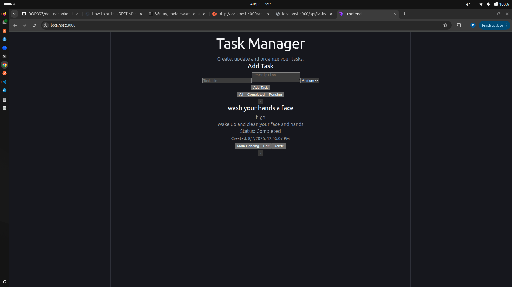

# Task Manager App

A full-stack task management application built with React and Express.js.

## Backend Setup

```bash
cd backend
npm install
npm start
```

Backend runs on:

`http://localhost:4000`

## Frontend Setup

```bash
cd frontend
npm install
npm start
```

Frontend runs on:

`http://localhost:3000`

## API Endpoints

- `GET /api/tasks` - Get all tasks
- `POST /api/tasks` - Create a new task
- `PUT /api/tasks/:id` - Update a task
- `DELETE /api/tasks/:id` - Delete a task
- `PATCH /api/tasks/:id/toggle` - Toggle completion status

## Task Model

```javascript
{
  id: number,
  title: string,
  description: string,
  completed: boolean,
  createdAt: Date,
  priority: "low" | "medium" | "high"
}
```

## Features

The application supports creating, editing and deleting tasks, toggling completion status, filtering by task status, priority indicators and a responsive endless animated carousel.

## Design Decisions

Tasks are stored in memory as required by the assignment.

API communication is separated into a service module.

Frontend functionality is split into reusable React components.

The endless carousel is implemented with React and vanilla JavaScript without an external carousel library. Boundary slides are cloned to provide a smooth continuous loop.

## Assumptions

- Task title is required.
- Description is optional.
- Priority must be low, medium or high.
- Data resets whenever the backend server restarts because storage is in memory.

## Time Spent

- Backend API: approximately 60 minutes
- Frontend functionality: approximately 90 minutes
- Carousel and styling: approximately 50 minutes
- Testing and documentation: approximately 20 minutes

Total: approximately 3 hours and 40 minutes.

## Screenshot  
